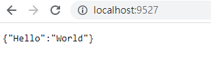

# Python-TCP-IP-Communication

# **Installation**

## **Git Clone** Command

1. Open Git Bash.
2. Clone.

```bash
# 複製 git 到本地
git clone https://github.com/HoningLo/Python-TCP-IP-Communication.git
cd Python-TCP-IP-Communication
```

## **Requirements**

- Python >= 3.6

Create a virtual environment:

```bash
python -m venv venv

# Windows
.\venv\scripts\activate

# Linux
source venv/bin/activate
```

Install the dependencies:

```bash
pip install -r requirements.txt
```

## **Headless Install**

Linux:

```bash
./install.sh
```

# Execute

## HttpAPI

Run the `main.py`:

```bash
python main.py
```

Browse to the sample application at `http://localhost:9527` in a web browser.



Edit the file  `main.py` and replace the parameters `HOST` and `PORT` with your specific IP address and port number.

```bash
# main.py

...
...
...

if __name__ == '__main__':
    HOST = "localhost"
    PORT = 9527
    uvicorn.run(app, host=HOST, port=PORT)
```

Edit the file `Requests_WebAPI.py` and replace the text `____Enter_Your_DeviceID____` with your DeviceID.

```bash
# main.py

...
data = {"DeviceID": "____Enter_Your_DeviceID____"}
...

```

Run the `Requests_WebAPI.py`:

```bash
python Requests_WebAPI.py
```

Result:


## Socket

### Build Server

Edit the file  `Socket_Server.py` and replace the parameters `HOST` and `PORT` with your specific IP address and port number.

```bash
# Socket_Server.py

...
...
...

if __name__ == '__main__':
    HOST = "localhost"
    PORT = 9527
    build_server(HOST, PORT)
```

Run the `Socket_Server.py`:

```bash
python Socket_Server.py
```

### Build Client

Edit the file  `Socket_Client.py` and replace the parameters `HOST` and `PORT` with your specific IP address and port number.

```bash
# Socket_Client.py

...
...
...

if __name__ == '__main__':
    HOST = "localhost"
    PORT = 9527
    send_message(HOST, PORT)
```

Run the `Socket_Client.py` :

```bash
python Socket_Client.py 
```

Server Result:


Client Result:


## ModbusTCP

# Reference